# Collections:

- What is collections ?
  - Collections is a framework provided by Java.
  - This framework provides many interfaces, and their implemented classes in order to store group of objects(elements) in a single entity.

- There is a **Collections** class which provide common **methods** like **filtering**, **sorting** etc., to perform on the classes provided.


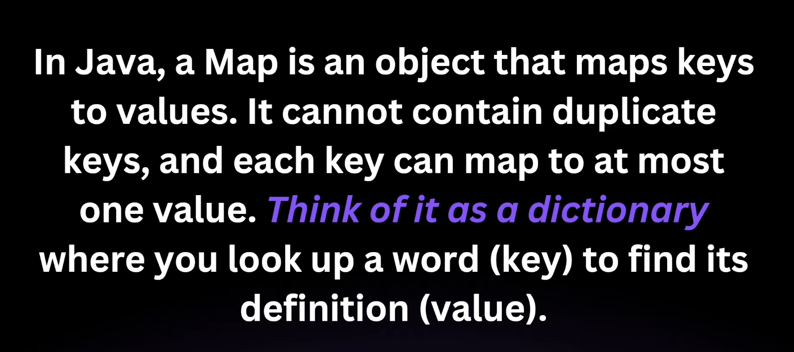
- HashTable <**class**> extends **Map**.


### Hashmaps
- 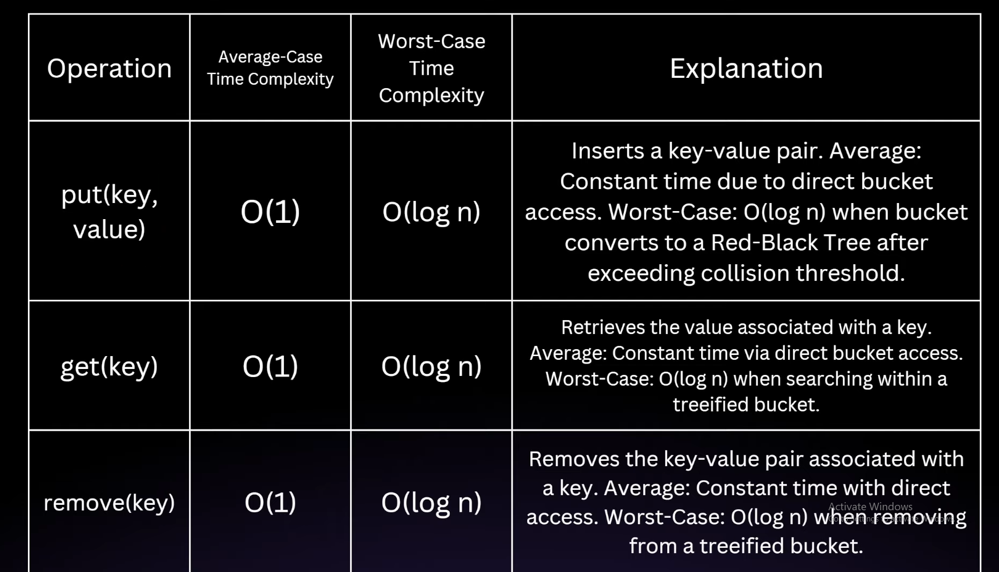
- 
- 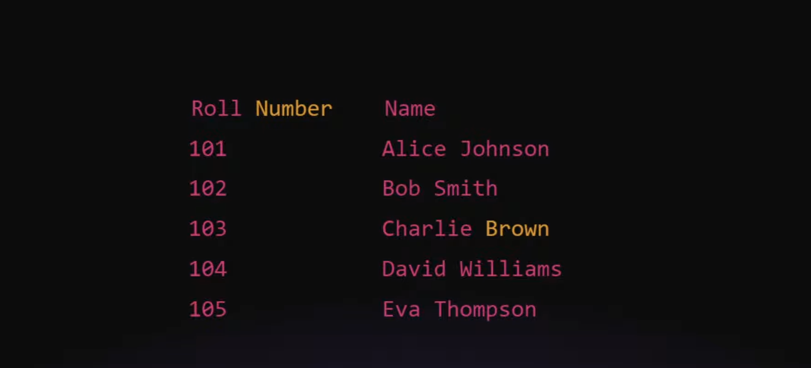
- 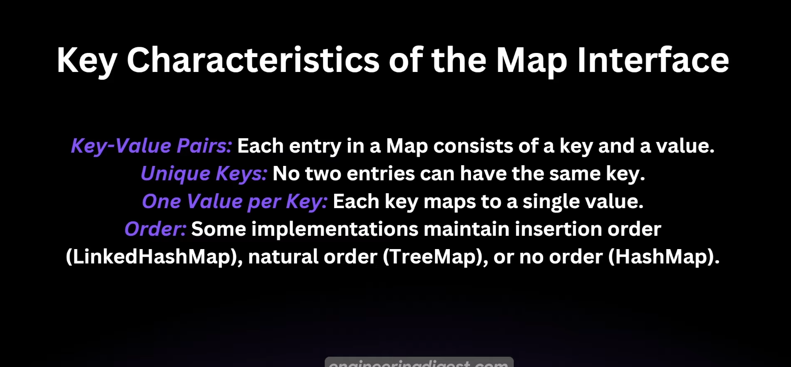
- 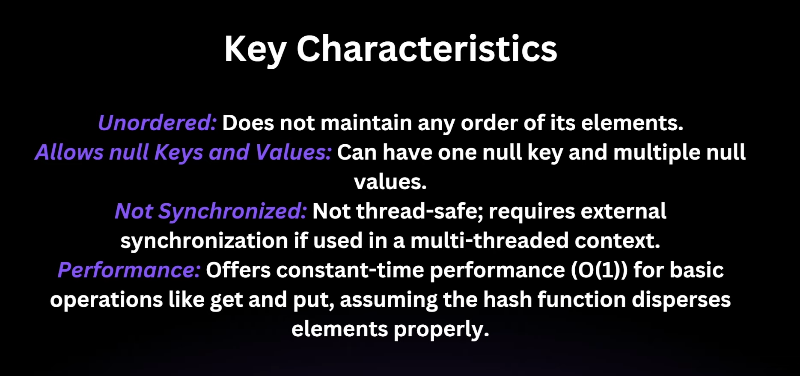
- Basic Operations of Hashmap:
  - ```
    package tutorials.hashmaps_tutorials;

    import java.util.HashMap;
    import java.util.Map;
    import java.util.Set;

    public class HashMapDemo {
        public static void main(String[] args) {
            // Declaration with no limit
            HashMap<Integer, String> map = new HashMap<>();
            // DEclaration with limit
            HashMap<Integer, String> map1 = new HashMap<>(10, 0.50f);

            // set data
            map.put(1, "A");
            map.put(2, "B");

            // get Data

            // with existing key
            System.out.println(map.get(1)); // "A"
            // with non-existing key
            System.out.println(map.get(3)); // null
            System.out.println(map); // {1=A, 2=B}

            // Over-riding:
            map.put(3, "Cc");
            System.out.println(map.get(3)); // Cc
            map.put(3, "C");
            System.out.println(map.get(3)); // C

            // to check key exists
            System.out.println(map.containsKey(10)); // false
            System.out.println(map.containsKey(1)); // true
            System.out.println(map.containsValue("X")); // false
            System.out.println(map.containsValue("B")); // true

            // Iterations: type:1
            Set<Integer> keys = map.keySet();
            System.out.print("{ ");
            for (int key : keys) {
                System.out.print(" " + key + "=" + map.get(key));
                System.out.print(",");
            }
            System.out.print("}");
            System.out.println();
            // Iterations: type:2
            System.out.print("{ ");
            Set<Map.Entry<Integer, String>> entrySet = map.entrySet();
            for (Map.Entry<Integer, String> entry : entrySet) {
                System.out.print(" " + entry.getKey() + "=" + entry.getValue());
                System.out.print(",");
            }
            System.out.print("}");

            System.out.println();
            // keeping null as value
            map.put(4, null);
            map.put(5, null);

            // keeping null as key
            map.put(null, "Null-1");
            map.put(null, "Null-2");
            System.out.println(map.get(4)); // null
            System.out.println(map.get(null)); // Null-2

            // delete exiting key
            map.put(26, "Z");
            System.out.println(map.remove(26));         // Z

            // delete non-exiting key
            System.out.println(map.remove(25));         // null

            map.put(7, "G");
            System.out.println(map.remove(7, "g"));  // false
            System.out.println(map.remove(7, "G"));  // true
        }
    }
    ```
- Internal structure of Hashmap:
  - **Key**
    - The identifier used to retrieve the value [map.get(key)]
  - **Value**
    - The data associated with the key. [value = map.get(key)]
  - **Bucket**
    - A place where key-value pairs are stored. Think of buckets as cells in a list(array).
  - **Hash function**
    - Converts a key into an index(bucket location) for storage.
    - 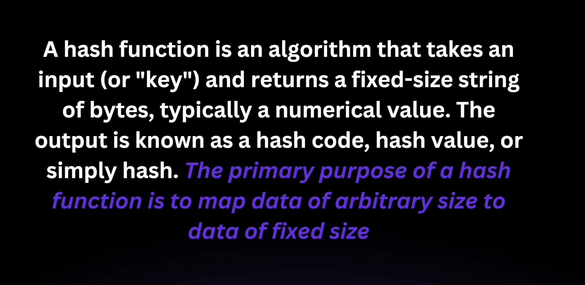
    - 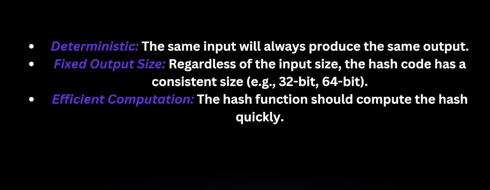
- How data is stored in HashMap:
  - **Step 1: Hashing the key**
    - 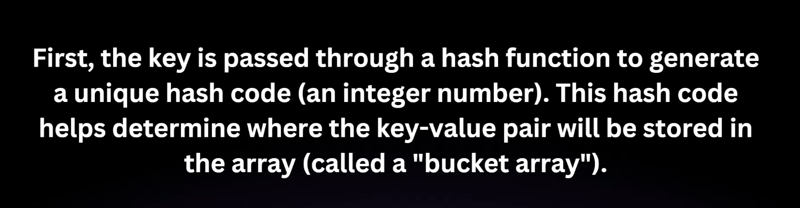
  - **Step 2: Calculating the Index**
    - 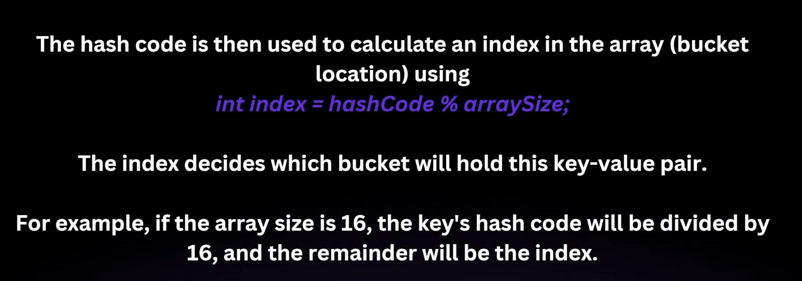
  - **Step 3: Storing in the bucket**
    - 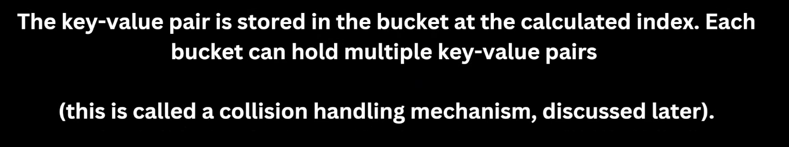
  - Example:
    - 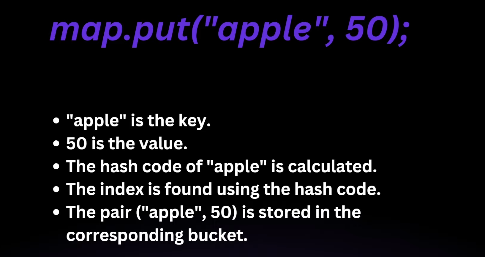
- How HashMap retrieves the data:
  - 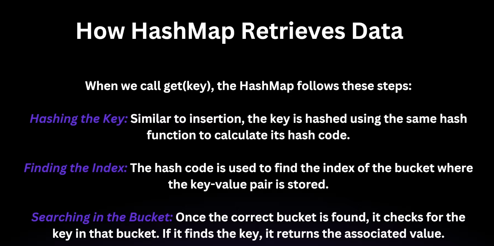
  - Collision:
    ```
    package tutorials.hashmaps_tutorials;
    
    public class GenerateHash {
        public static void main(String[] args) {
            System.out.println(createHash("ABC"));   // 8
            System.out.println(createHash("BCA"));   // 8
            System.out.println(createHash("CAB"));   // 8
        }

        public static int createHash(String key) {
            int sum = 0;
            for (char c : key.toCharArray()) {
                sum += (int) c;
            }
            return sum % 10;
        }
    }
    ```
    - For same hashcode, it results in collision. In such case, keys are kept in bucket in linked-list. 
    - Class structure of each node of linked list is
      - 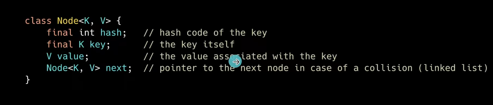
    - Handling collision
      - 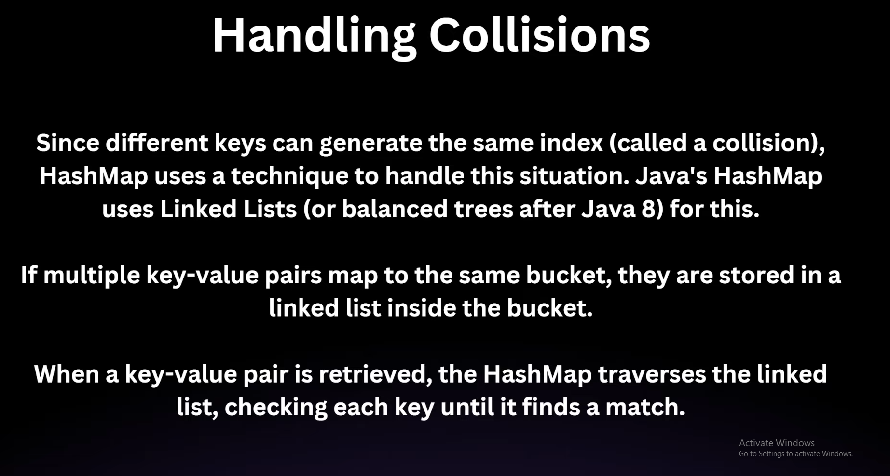
      - 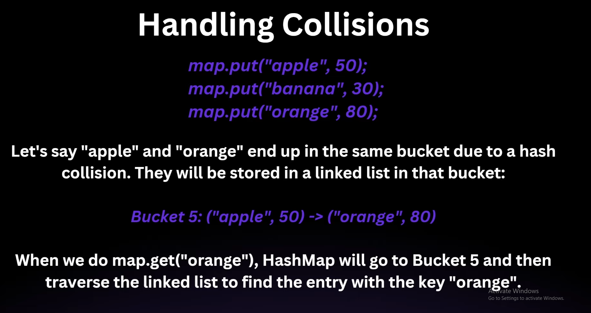
- Rehashing [HashMap Resizing]
  - 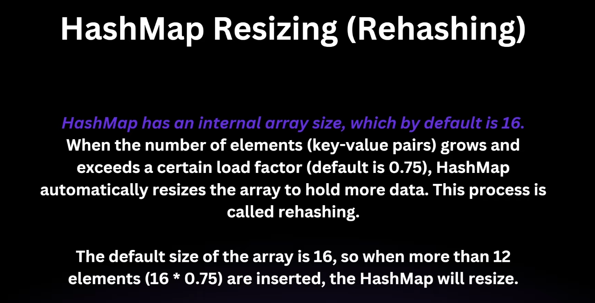
  - ```HashMap<Integer, String> map1 = new HashMap<>(10, 0.50f);```, here 0.50f is threshold value, when array size reaches this, array size increases.
  - Default size of bucket is 16 and threshold is 0.5f i.e at size 8 [TREEIFY_THRESHOLD], 
  - 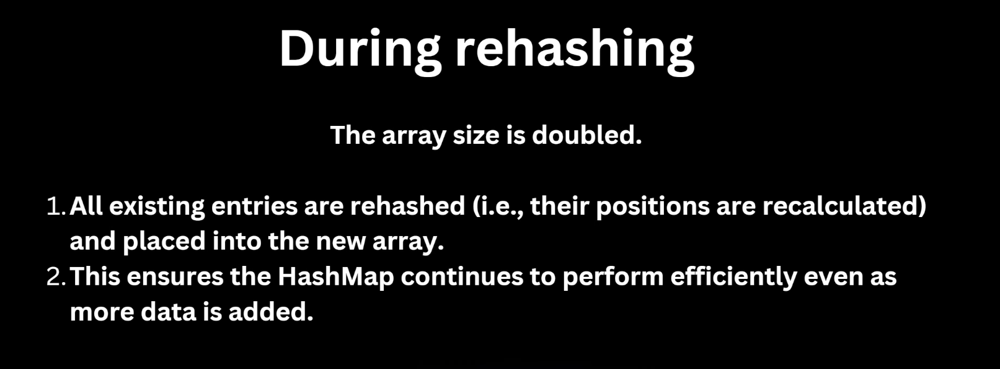
- Time complexity:
  - 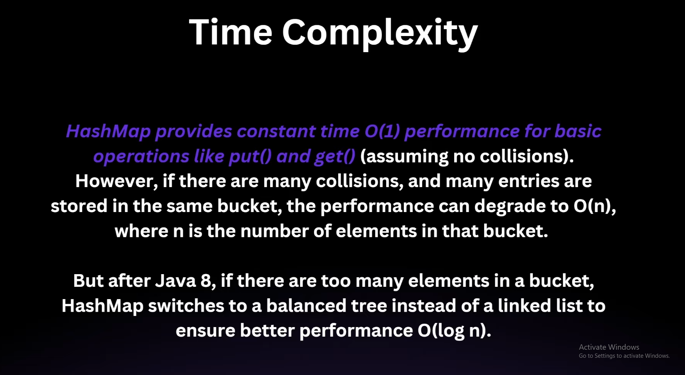
  - 
  - 
- Over-riding equals and Hash:
  - Code part:
