# Collections:

- What is collections ?
  - Collections is a framework provided by Java.
  - This framework provides many interfaces, and their implemented classes in order to store group of objects(elements) in a single entity.
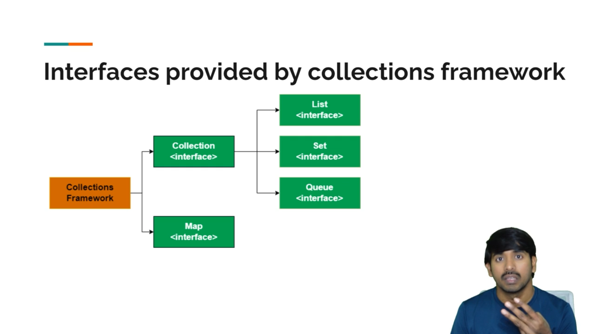
- There is a **Collections** class which provide common **methods** like **filtering**, **sorting** etc., to perform on the classes provided.
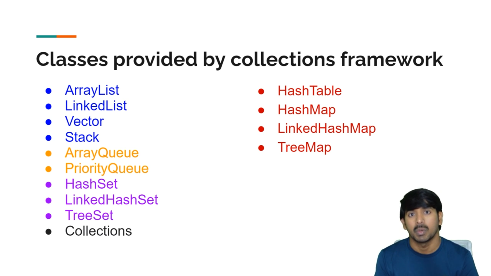
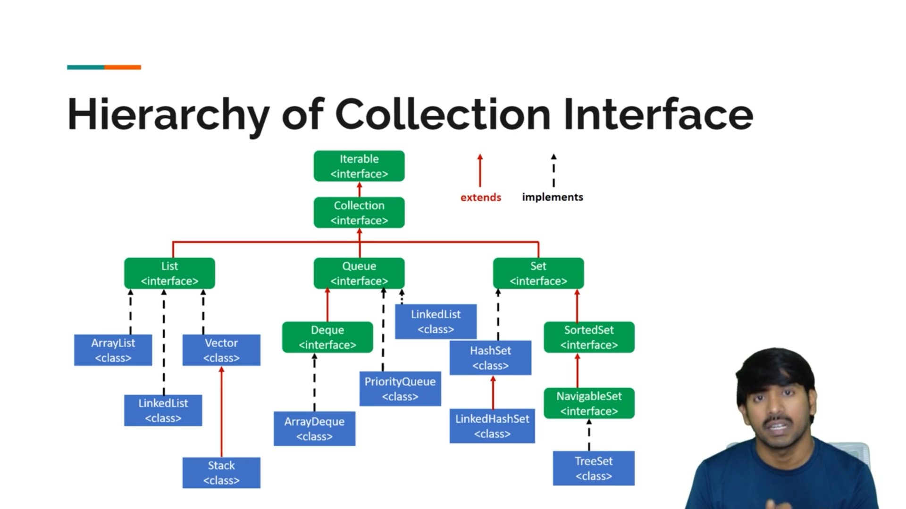
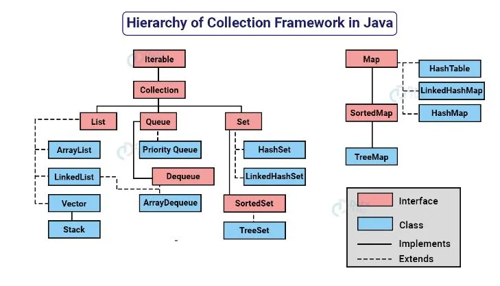
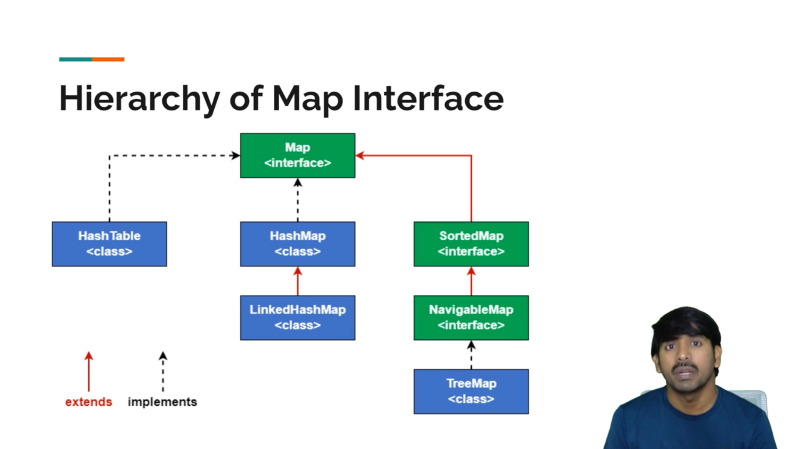
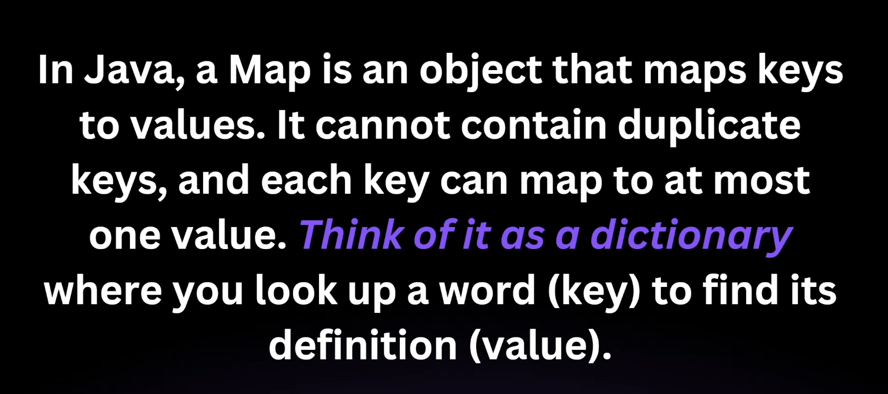
- HashTable <**class**> extends **Map**.

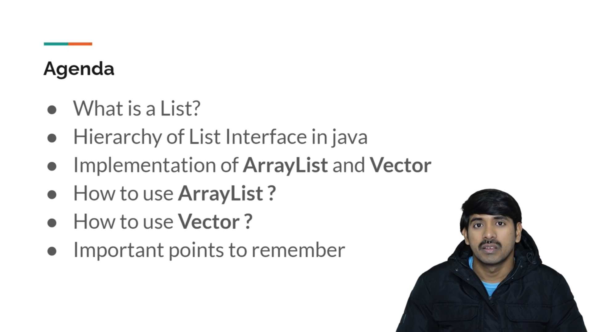
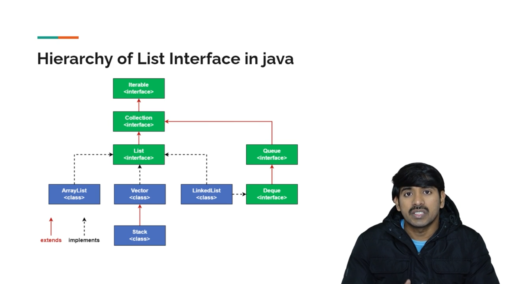
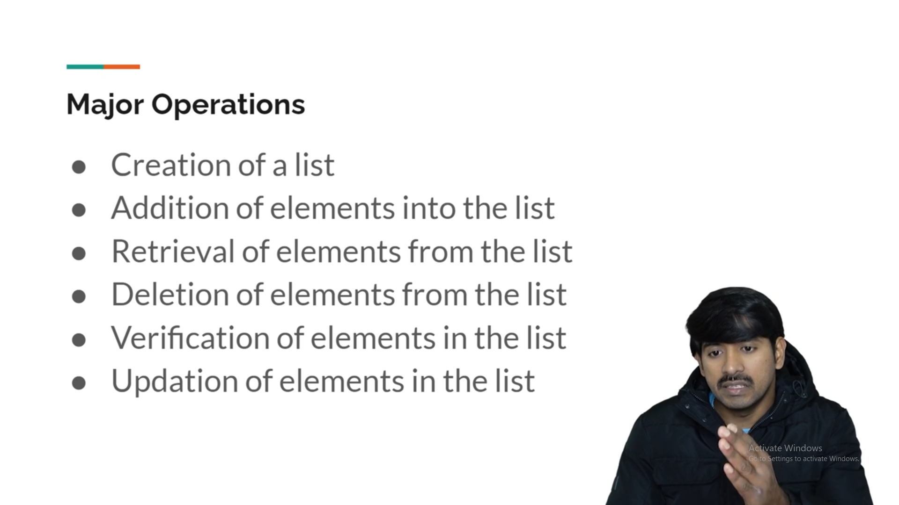


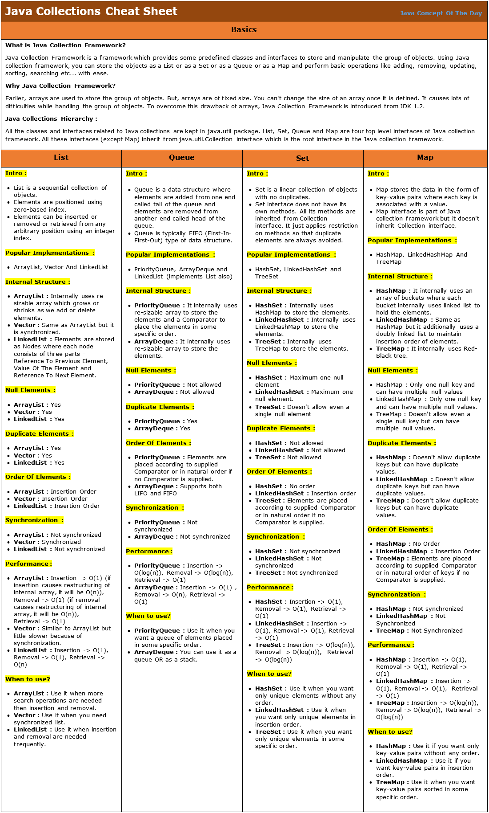

### ArrayList:
#### Internal Working:
- Unlike a regular array, which has a fixed size, an ArrayList can grow & shrink as elements are added or removed. This dynamic resizing is achieved by creating a new array when the current array is full & copying the elements to the new array.
- When you create an ArrayList, it has an initial capacity [default is 10]. The capacity refers to the size of the internal array that can hold elements before needing to resize.
  ```
  ArrayList<Integer> list = new ArrayList<>();
  ```
  - Now this list has:
    - capacity: 10
    - size: 0
- Adding Elements:
  - When we add an element to an ArrayList, the following steps occur:
    - **Check Capacity**
      - Before adding the new element, ArrayList checks if there is enough space in the internal array (elementData) If the array is full, it needs to be resized.
    - **Resize if necessary**
      - If the internal array is full, the ArrayList will create a new array with a larger capacity (usually 1.5x the current capacity) & copy the elements from the old array to the new array. This growth factor (1.5x) balances memory efficiency & resizing cost.
      - When resizing occurs, all elements from the old array are copied to the new array, which is an O(n) operation, where n is the number of elements in the ArrayList.
    - **Add the elements**
      - The new element is then added to the internal array at the appropriate index, and the size is incremented.
- Removing Elements:
  - **Check Bounds**
    - The ArrayList first checks if the index is within the valid range.
  - **Remove the Element**
    - The element is removed, and all the elements to the right of the element are shifted one position to the left to fill the gap.
  - **Reduce Size**
    - The size is decremented by 1.
#### Creating an ArrayList:
- creating an ArrayList without dataType i.e raw
  ```
  ArrayList v1 = new ArrayList();
  ```
- creating an ArrayList with dataType. [Always we have to give Wrapper classes but not primitive like int, boolean]
  ```
  ArrayList<Integer> v2 = new ArrayList<>();
  ```
- creating an ArrayList with an Array:
  ```
  Object[] arr = new Object[] { 1, 2, 3, 4, 5 };
  ArrayList<Integer> v3 = new ArrayList(Arrays.asList(arr));
  System.out.println("createArrayListWithArray: " + v3.size()); // 5
  ```
- creating an ArrayList with Size:
  ```
  ArrayList<String> v4 = new ArrayList<>(100);
  System.out.println("createArrayListWithSize: " + v4.size()); // 0
  ```
- creating an ArrayList from another collection.
  ```
  List<String> anotherList = Arrays.asList("A", "B", "C");
  ArrayList<String> listFromCollection = new ArrayList<>(anotherList);
  System.out.println(listFromCollection.size()); // 3
  ```
#### Adding elements to ArrayList:
- Adding elements to the end of the list:
  ```
  ArrayList<String> list = new ArrayList<>();
  list.add("A");
  list.add("C");
  ```
- Adding elements at given index of the list:
  ```
  ArrayList<String> list = new ArrayList<>();
  list.add(1, "B"); // "B" will be added at index 1 & shifts "C" to index 2.
  ```
- Adding another list:
  ```
  ArrayList<String> a = new ArrayList<>();
  ArrayList<String> a1 = new ArrayList<>();
  List<String> a2 = List.of("A", "B", "C");
  a.add("1");
  a.add("2");
  a.add("3");
  a.add("4");

  a1.add("govind");
  a1.add("maddala");

  a.add(0, "0");
  a.addAll(a1);
  a.addAll(3, a1);
  a.addAll(a2);
  System.out.println(a); 
  
  // [0, 1, 2, govind, maddala, 3, 4, govind, maddala, A, B, C]
  ```
  - Note: Let's say I have list of capacity 10. Now I added at 1st index without adding at before index, then it throws **java.lang.IndexOutOfBoundsException** error.

#### Accessing elements from ArrayList:
- Accessing can be done using **get(index_number)**
  ```
  ArrayList<String> v = new ArrayList<>();
  v.add("govind");
  v.add("maddala");

  System.out.println(v.get(0)); // maddala
  ```

#### Verify Elements/Collections exist In ArrayList:
- Verifying existence of 
  - elements with **contains(Value_want_to_check)** 
  - collection with **containsAll(collection_name)** 
  ```
  ArrayList<String> v = new ArrayList<>();
  v.add("govind");
  System.out.println(v.contains("govind")); // true

  ArrayList<String> a1 = new ArrayList<>();
  a1.add("govind");
  a1.add("maddala");
  System.out.println(v.containsAll(a1)); // false
  ```

#### Updating elements in ArrayList:
- Updating can be done using **set(index_no, updated_value)**
  ```
  ArrayList<String> v = new ArrayList<>();
  v.add("gowind");
  v.set(0, "govind"); // returns string
  System.out.println(v); // [govind]
  ```

#### Deleting an element or list from ArrayList:
- Deleting an element can be done using **remove(index_number)**
  ```
  ArrayList<String> v = new ArrayList<>();

  // removing object by index
  v.add("gowind");
  v.remove(0); 
  System.out.println(v); // []
  v.add("govind");
  System.out.println(v); // [govind]
  ```
- Deleting an element using value like **remove(value)**:
  - **Strings**
  ```
  ArrayList<String> v = new ArrayList<>();

  // removing object by value
  v.add("gowind");
  v.add("maddala");
  v.remove("maddala"); 
  ``` 
  - **Numbers**:
    - With Index way:
    ```
    ArrayList<Integer> nums = new ArrayList<>();
    nums.add(1);
    nums.add(2);
    nums.add(3);

    nums.remove(1) // 2 will be removed
    nums.remove(Integer.valueOf(1)) // 1 will be removed
    ```
  - Note:
    - nums.remove(1) // 2 will be removed
    - nums.remove(Integer.valueOf(1)) // 1 will be removed
- Deleting list can be done using **removeAll(index_number)**
  ```
  // Removing ArrayList from ArrayList:
  ArrayList<String> a = new ArrayList<>();
  ArrayList<String> a1 = new ArrayList<>();
  a.add("1");
  a.add("2");

  a1.add("govind");
  a1.add("maddala");
  a.addAll(a1);
  System.out.println(a); // [1, 2, govind, maddala]
  a.removeAll(a1);
  System.out.println(a); // [1, 2]
  a.addAll(a1);
  System.out.println(a); // [1, 2, govind, maddala]
  a.add(3, "3");
  System.out.println(a); // [1, 2, govind, 3, maddala]
  a.removeAll(a1);
  System.out.println(a); // [1, 2, 3]
  ```
#### Converting ArrayList to Array:
  ```
  ArrayList<String> v = new ArrayList<>();
  v.add("govind");
  v.add("govind");
  Object[] arr = v.toArray();
  String[] stringArr = v.toArray(new String[0]);
  System.out.println(Arrays.toString(arr)); // [govind, govind]
  ```
  - In general **toArray()** returns **Object[]** but if list is string array, then we have to code like:
  ```
  String[] stringArr = v.toArray(new String[0]);
  ```
  - Here **new String[0]** is just a convention to say output is a String array.

#### Sorting a ArrayList:
- Using **Collections.sort(numsList)**, we can sort a list in natural order.
  ```
  ArrayList<Integer> nums = new ArrayList<>();
  nums.add(5);
  nums.add(4);
  nums.add(1);
  nums.add(2);
  nums.add(3);

  Collections.sort(nums);
  System.out.println(nums); // [1, 2, 3, 4, 5]
  ```

#### Time Complexity:
- **Accessing** by index (get) is **O(1)**.
- **Adding** an element is **O(n)** in the worst case when resizing occurs.
- **Removing** elements can be **O(n)** because it may involves shifting elements.
- **Iteration** is **O(n)**.

#### List Misc:
- Ways of creating a List:
  ```
  ArrayList<Integer> list1 = new ArrayList<>();
  System.out.println(list1.getClass().getName()); 

  List<Integer> list2 = new ArrayList<>();
  System.out.println(list1.getClass().getName());

  List<String> list3 = Arrays.asList("A", "B");

  String[] arr = { "A", "B", "C" };
  List<String> list4 = Arrays.asList(arr);

  List<String> list5 = List.of("A", "B", "C");

  List<String> list5List = new ArrayList<>(list5);
  ```
  - Observations:
  1. list1 dataType is **java.util.ArrayList**
  2. list2, list3, list4 & list5 dataType is **java.util.Arrays$ArrayList** [Here ArrayList is not direct ArrayList but a nested static private class].
  3. Now with list1, we can add add and all but with other lists, we can't do addition or removal of elements because their size is fixed. But at index we can change the values.
  4. ```list2.add("C")``` throws exception.
  5. ```list2.set(1, "b")``` is possible.
  6. In modern java, **List.of** is there, through which we can't add, delete or replace also because with this we get immutable list. Here list5 is such kind.
  7. But all these can be used in ArrayList to create a list like: ```List<String> list5List = new ArrayList<>(list5);```.
  8. Now list5List can be used to add, delete and remove elements like an arrayList.

- Get ArrayList Capacity Using Reflexes:
  ```
  public static void getArrayListCapacityUsingReflexes()
          throws NoSuchFieldException, SecurityException, IllegalArgumentException, IllegalAccessException {
      ArrayList<Integer> list = new ArrayList<>(5);
      list.add(1);
      list.add(1);
      list.add(1);
      list.add(1);
      list.add(1);
      Field field = ArrayList.class.getDeclaredField("elementData");
      field.setAccessible(true);
      Object[] elementData = (Object[]) field.get(list);
      System.out.println("ArrayList Capacity is: Before" + elementData.length);

      list.add(1);
      elementData = (Object[]) field.get(list);
      System.out.println("ArrayList Capacity is: Before" + elementData.length);
  }
  ```
  - It won't work directly, we have to make some changes in IntelJ IDE.
  - 


### Hashmaps
- 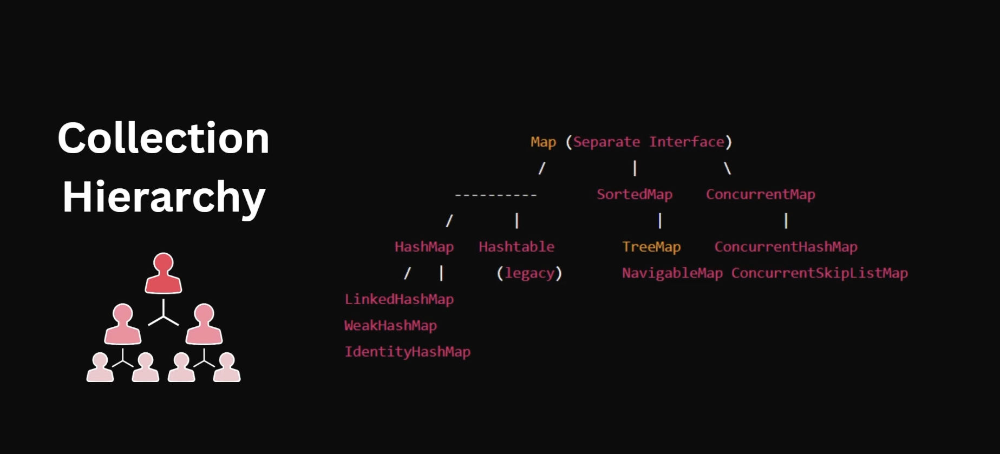
- 
- 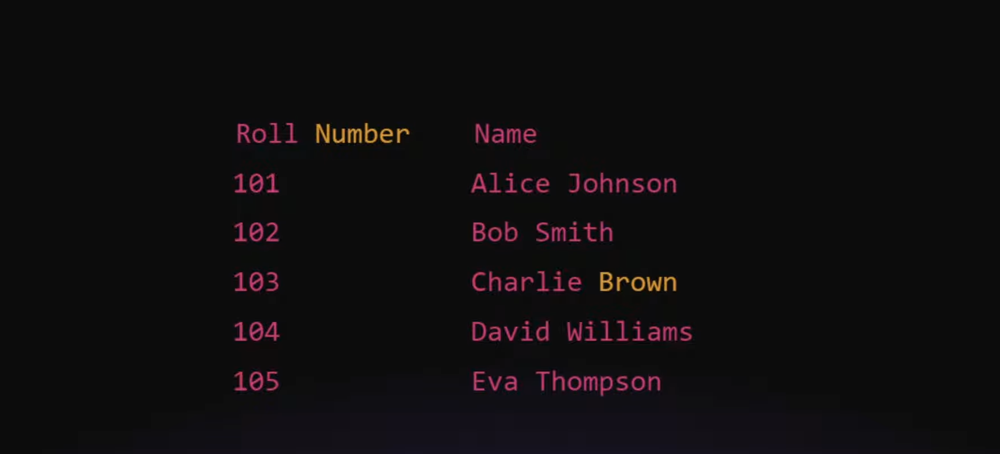
- 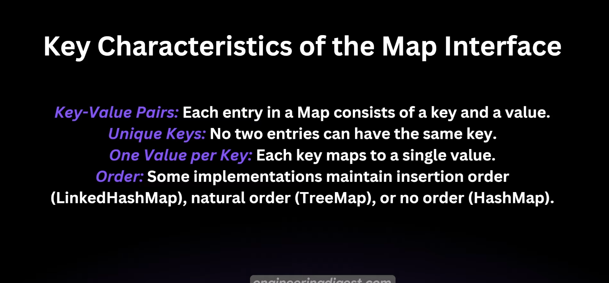
- 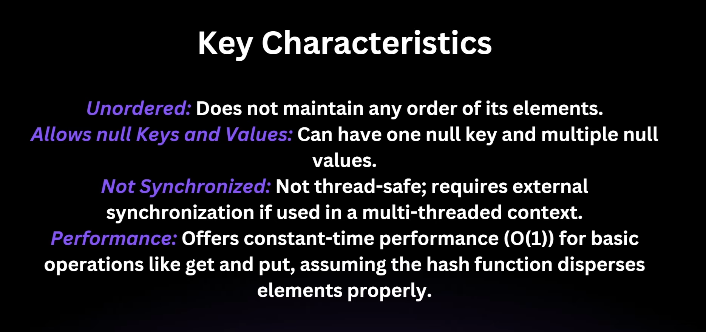
- Basic Operations of Hashmap:
  - ```
    package tutorials.hashmaps_tutorials;

    import java.util.HashMap;
    import java.util.Map;
    import java.util.Set;

    public class HashMapDemo {
        public static void main(String[] args) {
            // Declaration with no limit
            HashMap<Integer, String> map = new HashMap<>();
            // DEclaration with limit
            HashMap<Integer, String> map1 = new HashMap<>(10, 0.50f);

            // set data
            map.put(1, "A");
            map.put(2, "B");

            // get Data

            // with existing key
            System.out.println(map.get(1)); // "A"
            // with non-existing key
            System.out.println(map.get(3)); // null
            System.out.println(map); // {1=A, 2=B}

            // Over-riding:
            map.put(3, "Cc");
            System.out.println(map.get(3)); // Cc
            map.put(3, "C");
            System.out.println(map.get(3)); // C

            // to check key exists
            System.out.println(map.containsKey(10)); // false
            System.out.println(map.containsKey(1)); // true
            System.out.println(map.containsValue("X")); // false
            System.out.println(map.containsValue("B")); // true

            // Iterations: type:1
            Set<Integer> keys = map.keySet();
            System.out.print("{ ");
            for (int key : keys) {
                System.out.print(" " + key + "=" + map.get(key));
                System.out.print(",");
            }
            System.out.print("}");
            System.out.println();
            // Iterations: type:2
            System.out.print("{ ");
            Set<Map.Entry<Integer, String>> entrySet = map.entrySet();
            for (Map.Entry<Integer, String> entry : entrySet) {
                System.out.print(" " + entry.getKey() + "=" + entry.getValue());
                System.out.print(",");
            }
            System.out.print("}");

            System.out.println();
            // keeping null as value
            map.put(4, null);
            map.put(5, null);

            // keeping null as key
            map.put(null, "Null-1");
            map.put(null, "Null-2");
            System.out.println(map.get(4)); // null
            System.out.println(map.get(null)); // Null-2

            // delete exiting key
            map.put(26, "Z");
            System.out.println(map.remove(26));         // Z

            // delete non-exiting key
            System.out.println(map.remove(25));         // null

            map.put(7, "G");
            System.out.println(map.remove(7, "g"));  // false
            System.out.println(map.remove(7, "G"));  // true
        }
    }
    ```
- Internal structure of Hashmap:
  - **Key**
    - The identifier used to retrieve the value [map.get(key)]
  - **Value**
    - The data associated with the key. [value = map.get(key)]
  - **Bucket**
    - A place where key-value pairs are stored. Think of buckets as cells in a list(array).
  - **Hash function**
    - Converts a key into an index(bucket location) for storage.
    - 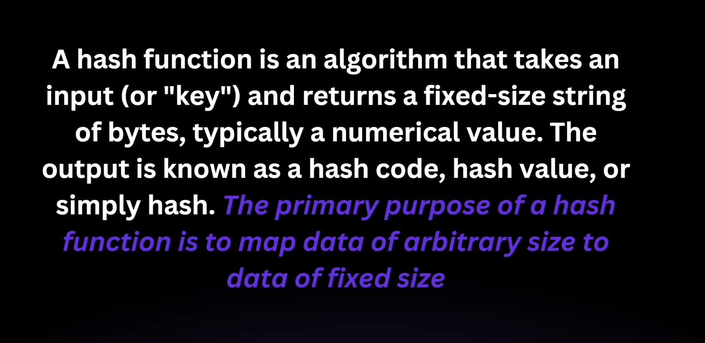
    - 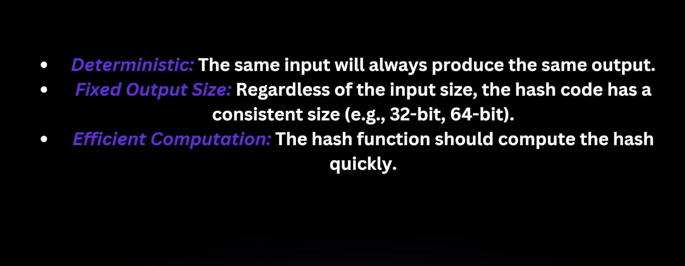
- How data is stored in HashMap:
  - **Step 1: Hashing the key**
    - 
  - **Step 2: Calculating the Index**
    - 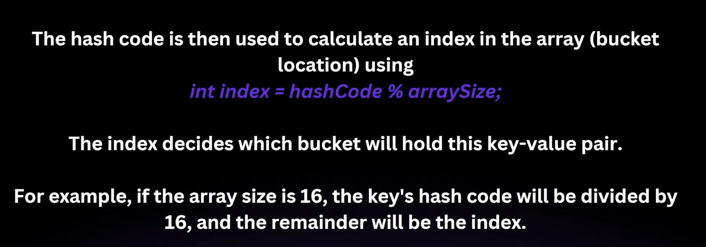
  - **Step 3: Storing in the bucket**
    - 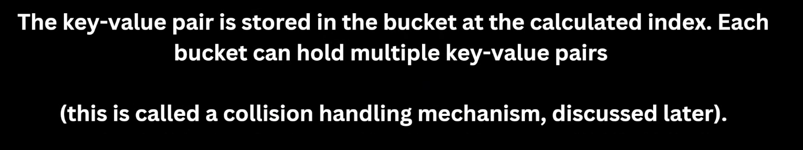
  - Example:
    - 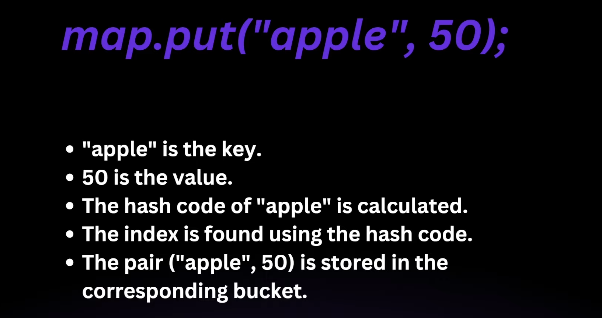
- How HashMap retrieves the data:
  - 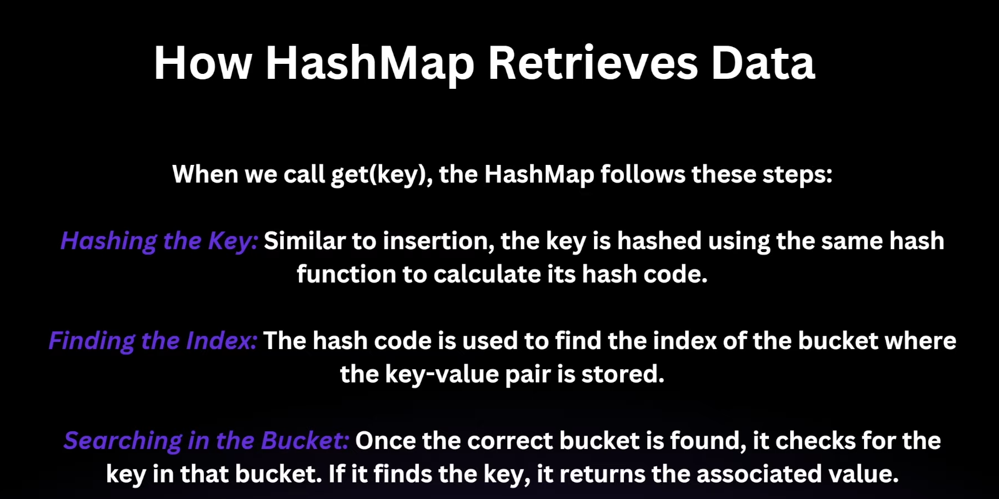
  - Collision:
    ```
    package tutorials.hashmaps_tutorials;
    
    public class GenerateHash {
        public static void main(String[] args) {
            System.out.println(createHash("ABC"));   // 8
            System.out.println(createHash("BCA"));   // 8
            System.out.println(createHash("CAB"));   // 8
        }

        public static int createHash(String key) {
            int sum = 0;
            for (char c : key.toCharArray()) {
                sum += (int) c;
            }
            return sum % 10;
        }
    }
    ```
    - For same hashcode, it results in collision. In such case, keys are kept in bucket in linked-list. 
    - Class structure of each node of linked list is
      - 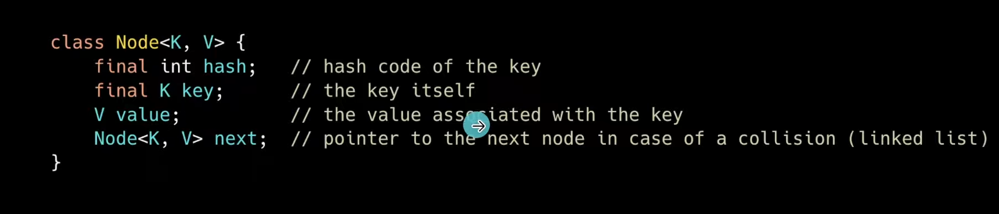
    - Handling collision
      - 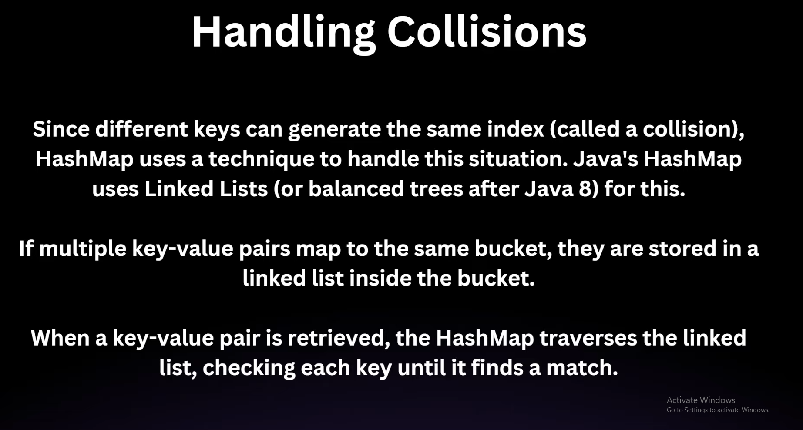
      - 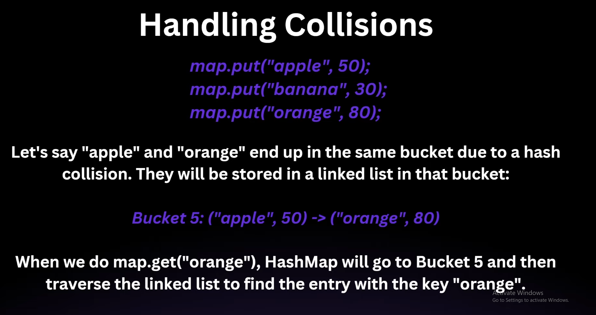
- Rehashing [HashMap Resizing]
  - 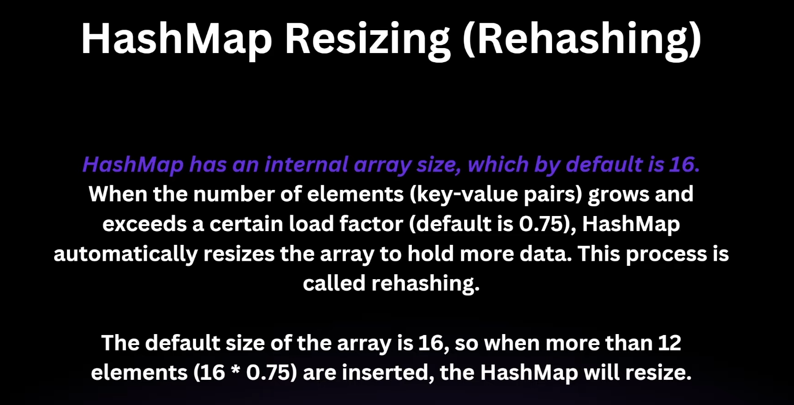
  - ```HashMap<Integer, String> map1 = new HashMap<>(10, 0.50f);```, here 0.50f is threshold value, when array size reaches this, array size increases.
  - Default size of bucket is 16 and threshold is 0.5f i.e at size 8 [TREEIFY_THRESHOLD], 
  - 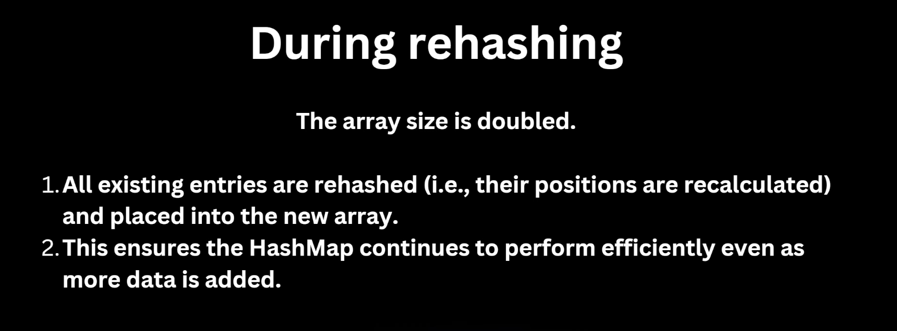
- Time complexity:
  - 
  - 
- Over-riding equals and Hash:
  - When objects are provided as keys, some ambiguities happen.
  - Since hash functions 
  - Code part:
